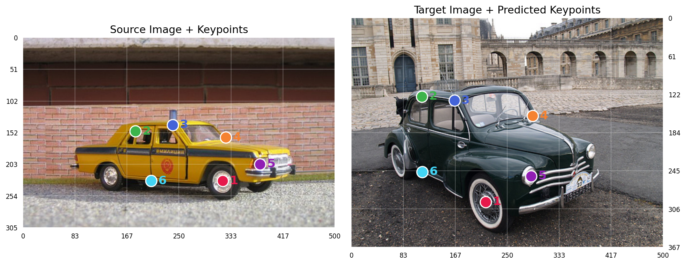

<div align="center">

# MARCO: Navigating the Unseen Space of Semantic Correspondence

✨ **CVPR 2026 Oral** ✨

<p align="center">
  <a href="ARXIV_LINK"></a>
  <a href="https://visinf.github.io/MARCO"></a>
  <a href="docs/data.md#-mp-100"></a>
  <a href=https://colab.research.google.com/drive/1EjSwryl2Dure2S3kZFNYDEKFhzoaayqu?usp=sharing></a>
</p>

**[Claudia Cuttano](https://scholar.google.com/citations?user=W7lNKNsAAAAJ)<sup>1,2</sup> ·
[Gabriele Trivigno](https://scholar.google.com/citations?user=JXf_iToAAAAJ)<sup>1</sup> ·
[Carlo Masone](https://scholar.google.com/citations?user=cM3Iz_4AAAAJ)<sup>1</sup> ·
[Stefan Roth](https://scholar.google.com/citations?user=0yDoR0AAAAAJ&hl=en)<sup>2,3,4</sup>**

<sup>1</sup> Politecnico di Torino &nbsp;&nbsp;
<sup>2</sup> TU Darmstadt &nbsp;&nbsp;
<sup>3</sup> hessian.AI &nbsp;&nbsp;
<sup>4</sup> ELIZA

</div>

MARCO learns **generalizable semantic correspondence** from sparse supervision, turning a handful of keypoints into **dense matches** that transfer to **unseen keypoints** and **novel categories**.

✨ **Seen keypoints, unseen keypoints, new categories**: accurate correspondence not only in-domain, but also on novel keypoints and categories never seen during training  
🌍 **Dense supervision**: from an average of 20 sparse annotated keypoints, we derive thousands of dense correspondences across the object surface  
📍 **Efficiency**: a single DINOv2 backbone, **3× smaller** and **10× faster** than diffusion-based methods  
📊 **MP-100 benchmark**: a new testbed for evaluating transfer to novel keypoints and unseen categories

https://github.com/user-attachments/assets/b490585d-27f4-43fc-a807-f0ba09d3f8a4


## Environment
To get started, create a Conda environment and install the required dependencies. The experiments in the paper were run with **PyTorch 2.7.1 (CUDA 12.6)**, which we provide as a reference configuration.

To set up the environment using Conda, run:

```bash
conda create -n marco python=3.10 -y 
conda activate marco
pip install -r requirements.txt
```


## 📦 Data

Please refer to [docs/data.md](docs/data.md) for dataset preparation instructions. 

## 📍 Minimal Usage

Here is an example showing how to transfer a set of source keypoints to a target image with MARCO.   
You can also try MARCO directly in our [Colab Demo](https://colab.research.google.com/drive/1EjSwryl2Dure2S3kZFNYDEKFhzoaayqu?usp=sharing) on your own images and keypoints ✨


```python
import torch

src_path, trg_path = "assets/images/src_car.jpg", "assets/images/trg_car.jpg"
output_path = "trg_car_pred.png"
device = "cuda" if torch.cuda.is_available() else "cpu"

# Source keypoints in original image pixel coordinates (x, y)
src_kps = [[320, 230], [180, 150], [240, 140], 
           [325, 160], [380, 203], [205, 230]]

# Load pretrained model from Torch Hub
model = torch.hub.load("visinf/MARCO", "marco", pretrained=True, trust_repo=True, device=device)
model.eval()

# Prepare input
inputs = model.preprocess_data(src_path, trg_path, src_kps, device=device)

# Predict
with torch.no_grad():
    pred_kps = model(**inputs)

# Visualize
model.visualize_prediction(src_path, trg_path, src_kps, pred_kps, output_path)
```

An example output is shown below:
<p align="center">
  
</p>


## 🚀 Inference

We release two pretrained MARCO checkpoints, both based on a **ViT-L/14 DINOv2 backbone**. The first model is trained on **SPair-71k**, while the second is **pretrained on AP-10k and then fine-tuned on SPair-71k**.  

<table>
  <thead>
    <tr>
      <th align="left">Checkpoint</th>
      <th align="left">Backbone</th>
      <th align="left">Params</th>
      <th align="left">Pretrain</th>
      <th align="left">Train</th>
      <th align="center">SPair-71k</th>
      <th align="center">SPair-U</th>
    </tr>
  </thead>
  <tbody>
    <tr>
      <td align="left"><a href="https://drive.google.com/file/d/1_of8iQjenTttF5Jld69LNf9M0vnM2Xbx/view?usp=sharing"><code>marco_spair.pth</code></a></td>
      <td align="left">ViT-L/14</td>
      <td align="left">323 M</td>
      <td align="left">—</td>
      <td align="left">SPair-71k</td>
      <td align="center">87.2</td>
      <td align="center">67.5</td>
    </tr>
    <tr>
      <td align="left"><a href="https://drive.google.com/file/d/1d2If4nBUy7SjFberZVuXsFr_zqLXvoU8/view?usp=sharing"><code>marco_ap_spair.pth</code></a></td>
      <td align="left">ViT-L/14</td>
      <td align="left">323 M</td>
      <td align="left">AP-10k</td>
      <td align="left">SPair-71k</td>
      <td align="center">87.3</td>
      <td align="center">69.7</td>
    </tr>
  </tbody>
</table>


Download checkpoints:

```bash
# SPair-71k
gdown "https://drive.google.com/uc?id=1_of8iQjenTttF5Jld69LNf9M0vnM2Xbx"
# AP-10k + SPair-71k
gdown "https://drive.google.com/uc?id=1d2If4nBUy7SjFberZVuXsFr_zqLXvoU8"
```
Run evaluation with:

```bash
python evaluate.py --dataset spair --checkpoint path/to/checkpoint.pth
```

Supported `--dataset` are `spair`, `spair-u`, `pf-pascal`, `ap-10k`, and `mp-100`.  

We use [OmegaConf](https://omegaconf.readthedocs.io), so any config key can be overridden from the command line using `<key>=<value>`.

Common options include:
- `inference_res` to change the evaluation resolution
- `eval_subset` to select the evaluation split for `ap-10k` and `mp-100`:
  - for `ap-10k`: `intra-species`, `cross-species`, `cross-family` (default: `intra-species`)
  - for `mp-100`: `clothing`, `animal_face`, `animal_body_unseen`, `furniture`, `human_body` (default: `furniture`)
- `name_exp` to set the experiment name


For example, you can override the default configuration as follows:


```bash
# SPair-71k
python evaluate.py --dataset spair --checkpoint marco_spair.pth inference_res=840 name_exp=marco_spair
```

```bash
# MP-100 — animal face 
python evaluate.py --dataset mp-100 --checkpoint marco_spair.pth eval_subset=animal_face name_exp=marco_mp100_animal_face
```
For multi-GPU evaluation, use `torchrun`:

```bash
# Evaluation on 4 GPUs on a single node
torchrun --nproc_per_node=4 evaluate.py --dataset spair --checkpoint marco_spair.pth
```

## 🏋️ Training

Below we provide the training scripts used to train MARCO.

### 1. (Optional) SAM mask preprocessing

During training, MARCO computes the flow inside object masks.

- **SPair-71k** — ground-truth masks are already provided in the dataset, so using SAM masks is **optional**. In the paper, we use SAM-produced masks for fairness of comparison.
- **AP-10k** and **PF-Pascal** — SAM masks are **required**, since the dataset does not provide ground-truth masks.


```bash
pip install git+https://github.com/facebookresearch/segment-anything.git
wget https://dl.fbaipublicfiles.com/segment_anything/sam_vit_b_01ec64.pth -P pretrain/

python scripts/preprocess_masks_sam.py --dataset spair     # optional
python scripts/preprocess_masks_sam.py --dataset ap-10k    # required
python scripts/preprocess_masks_sam.py --dataset pf-pascal # required
```

In practice, we observe a negligible performance difference on SPair-71k when using the ground-truth masks instead of SAM-produced masks. 

### 2. Running training

Run training with:

```bash
python train.py --dataset spair 
```

Supported `--dataset` at training are: `spair`, `ap-10k`, `pf-pascal`. 


- for `spair`, ground-truth masks are used; SAM masks are off by default (`use_sam_masks: false` in the dataset config) but can be enabled with `use_sam_masks=true`
- for `ap-10k` and `pf-pascal`, SAM masks are **enabled by default** (`use_sam_masks: true` in the dataset config)


Training scripts:

```bash
# SPair-71k
python train.py --dataset spair name_exp=marco_spair
```

```bash
# AP-10k
python train.py --dataset ap-10k name_exp=marco_ap10k
```

```bash
# PF-Pascal
python train.py --dataset pf-pascal name_exp=marco_pfpascal
```

```bash
# AP-10k pretraining + SPair-71k fine-tuning

# Step 1
python train.py --dataset ap-10k epochs=1 name_exp=marco_ap10k

# Step 2
python train.py --dataset spair --checkpoint output/marco_ap10k_<timestamp>/checkpoint0001.pth name_exp=marco_ap_spair
```

We use [OmegaConf](https://omegaconf.readthedocs.io), so any config key can be overridden from the command line using `<key>=<value>`.

Common options include:

- `epochs` to set the number of training epochs
- `batch_size` to set the batch size
- `lr` to set the learning rate
- `train_res` to change the training resolution
- `validate` to enable or disable validation during training
- `name_exp` to set the experiment name

### Distributed training

For multi-GPU training, use `torchrun`:

```bash
# Training on 4 GPUs on a single node
torchrun --nproc_per_node=4 train.py --dataset spair batch_size=12 name_exp=marco_spair_ddp
```
The total batch size is controlled by `batch_size` and is split across GPUs.

### Resume Training
To resume training from a checkpoint, pass its path with `resume_train`:

```bash
python train.py --dataset spair resume_train=output/marco_spair_<timestamp>/checkpoint000X.pth name_exp=marco_spair_resume
```

## Citation

If you find this work useful, please cite:

```bibtex
@inproceedings{cuttano2026marco,
  title     = {{MARCO}: Navigating the Unseen Space of Semantic Correspondence},
  author    = {Claudia Cuttano and Gabriele Trivigno and Carlo Masone and Stefan Roth},
  booktitle = {Proceedings of the IEEE/CVF Conference on Computer Vision and Pattern Recognition (CVPR)},
  year      = {2026}
}
```

## Acknowledgements

We gratefully acknowledge the contributions of the following open-source projects:

- [DINOv2](https://github.com/facebookresearch/dinov2) 
- [GeoAware-SC](https://github.com/Junyi42/GeoAware-SC)
